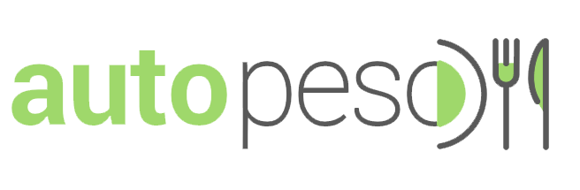
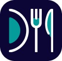
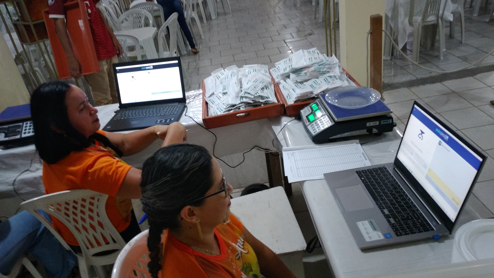
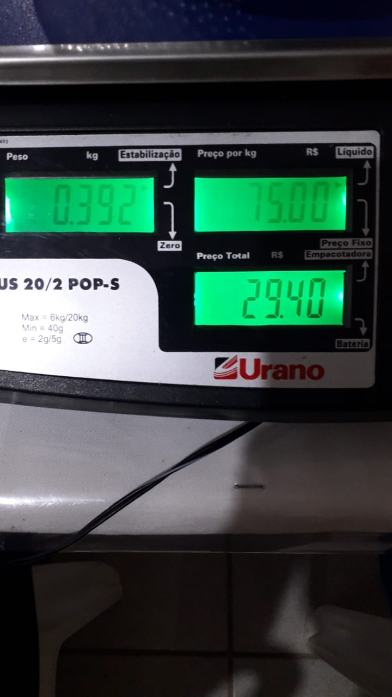
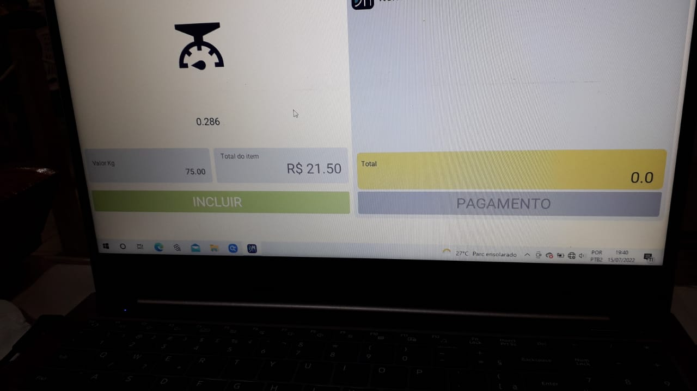

#### Sistema para pesagem automática de prato.

>  **_O Projeto:_**  Software desktop construído por alunos do 3º ano do curso de Desenvolvimento de Sistemas do Instituto Federal de Educação, Ciência e Tecnologia do Pará (IFPA).

######⭐⭐⭐⭐⭐

# 🚀 O que é?
Um sistema desktop desenvolvido em Python para realizar a pesagem automática de pratos em um pequeno restaurante self-service criado temporariamente, durante a festividade da padroeira, em Óbidos-PA. A ferramenta possui recursos como a conexão serial e bluetooth para a comunicação entre a balança e o software; utilização de banco de dados local com backup e relatórios de vendas diários
O sistema é opensource, o que significa que sua utilização é gratuita e seu código ficará disponível no github.

> __NOTA__: O cliente (Festividade de Santana), forneceu requisitos para o desenvolvimento do software, cedeu o espaço e equipamentos nescessários para o teste do projeto. Não havendo nenhum tipo de contrato ou repasse financeiro para a equipe. 

# 🛠 Ferramentas e Recursos
> Os software, liguagens de programação e bibliotecas a seguir, foram utilizadas para o desenvolvimento do projeto.

> É um aplicativo de gerenciamento de projeto baseado na web originalmente desenvolvido em 2011 pela então Fog Creek Software. Em 2017, foi adquirido pela empresa australiana Atlassian. Ele opera um modelo de negócio freemium.

>  É um editor gráfico de vetor e prototipagem de projetos de design baseado principalmente no navegador web, com ferramentas offline adicionais para aplicações desktop para GNU/Linux, macOS e Windows

>  É uma linguagem interpretada, o que significa que ela traduz o código analisado e o executa. Na prática, a sua grande vantagem é que ela traz soluções para os mais variados tipos de problemas, sejam eles web, desktop ou mobile.

>  É uma extensão da estrutura Kivy. KivyMD é uma coleção de widgets de Material Design para uso com Kivy, uma estrutura de GUI para fazer aplicativos móveis. É semelhante à estrutura Kivy, mas fornece uma GUI mais atraente.

>  O Visual Studio Code é um editor de código-fonte desenvolvido pela Microsoft para Windows, Linux e macOS. Ele inclui suporte para depuração, controle de versionamento Git incorporado, realce de sintaxe, complementação inteligente de código, snippets e refatoração de código.

### 📆 Cronograma

> __⭐Primeira fase__
  > - Levantamento de requisitos.
  > - Desenvolvimento de protótipo.
  > - Aceitação do protótipo pelos stackholders.

> __⭐Segunda fase__
  > - Estudos preliminares das ferramentas e recursos.
  > - Testes de comunicação com a balança.
  > - Desenvolvimento de módulo de comunicação.

> __⭐Terceira fase__
  > - Desenvolvimento da interface (front-end)
  > - Desenvolvimento da lógica do negócio (back-end)

> __⭐Quarta fase__
  > - Teste da aplicação em ambiente de desenvolvimento
  > - Aprovação dos testes
  > - Instação e Testes da aplicação em ambiente de produção

# 💻 Registros do projeto
\
O software foi utilizando em um restaurante self-service, durante a festividade da padroeira da cidade de Óbidos-PA.
O espaço era amplo e contava com gondolas para as comidas e dois caixas que utilizavam duas cópias do sistema com banco de dados independentes (requisitos do cliente.)

\
O fluxo do processo inicia quando o cliente escolhe sua refeição nas gondulas e se encaminha para o caixa. Lá ele irá colocar seu prato na balança. O software autopeso reconhece o novo estado da balança, calcula o valor do prato e registra na tabela itens de vendas. Se houver outros pratos para pesagem, na mesma venda, o operador do sistema poderá incluir após nova pesagem. Após isso, a venda pode ser finalizada e o pagamento registrado

\
Os dados de pagamentos será registrados e exibidos no relatório diário.

# 💡 Projetos Futuros

Apesar de uma automação ter sido implementada, o projeto pode escalar suas pontencialidades com o desenvolvimento de processos com menor interferencia humana, como por exemplo o pagamento automático via cartão de crédito ou sistema pix com geração de Qrcode na tela do sistema. Esta melhoria poderá gerar um produto inovador e com potencial emprendedor.

# 🦾Equipe do projeto
<table>
  <tr>
    <td align="center">
      <a href="#">
         
        
          <b>João Lúcio   (Orientador)</b>
        
      </a>
    </td>
    <td align="center">
      <a href="#">
         
        
          <b>Alan Lopes   (Bolsista)</b>
        
      </a>
    </td>

  <td align="center">
    <a href="#">
       
      
        <b>Karol Souza      (Vonluntária)</b>
      
    </a>
  </td>

  </tr>
</table>

## 📝 License
This project is under license. See the file [LICENSE](LICENSE.md) for more details.